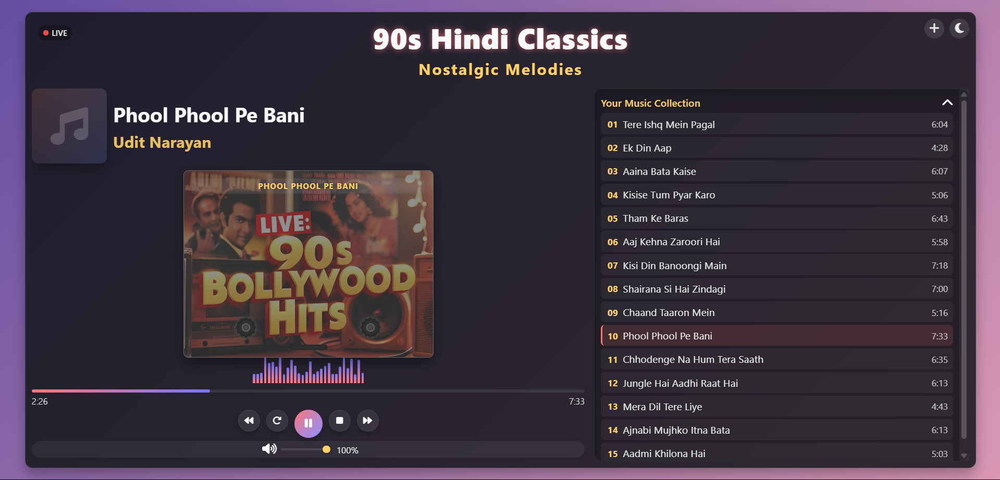

# 🎵 Nostalgia Beats - 90s Hindi Music Player


<p align="center">
  
</p>

## ✨ Overview

**Nostalgia Beats** is a beautiful, responsive web-based music player specifically designed for streaming classic 90s Hindi music. This application offers a nostalgic cassette-inspired interface with modern playback controls and visualizations, creating a perfect blend of retro aesthetics and modern functionality.

The player is built entirely with HTML, CSS, and vanilla JavaScript - no frameworks or libraries required. It's lightweight, fast, and works seamlessly across all devices including mobiles and tablets.

## 🚀 Features

### Core Functionality
- **Complete Media Controls**: Play, pause, stop, restart, previous, and next track controls
- **Progress Tracking**: Interactive progress bar with real-time updates
- **Time Display**: Current and total time indicators
- **Volume Control**: Adjustable audio volume slider

### Visual Elements
- **Cassette Animation**: Realistic cassette tape with rotating reels that sync with playback
- **Audio Visualizer**: Dynamic audio visualization bars
- **Live Status Indicator**: Pulsing "LIVE" badge when streaming
- **Responsive Playlist**: Scrollable playlist with highlighted active song

### User Experience
- **Mobile-First Design**: Fully responsive layout that works on all screen sizes
- **Smooth Animations**: Polished transitions and effects for a premium feel
- **Accessibility Features**: Keyboard navigation and screen reader support
- **Cross-Browser Compatibility**: Works on all modern browsers

## 🔧 Technical Implementation

### Front-End Architecture
The application is built using modern web standards:

- **HTML5** for semantic structure
- **CSS3** for styling and animations
- **JavaScript (ES6+)** for interactive functionality

### Key Design Patterns
- **Event-Driven Architecture**: All user interactions trigger appropriate events
- **Object-Oriented Approach**: Structured code organization for maintainability
- **Responsive Design**: Fluid layouts and media queries for all device types

### Audio Processing
- Custom audio stream handling
- Real-time progress tracking
- Visualizer implementation using dynamic DOM manipulation

## 💻 Installation & Setup

### Prerequisites
- Web server (Apache, Nginx, etc.)
- Modern web browser

### Quick Start
1. Clone the repository:
```bash
git clone https://github.com/yourusername/nostalgia-beats.git
```

2. Navigate to the project directory:
```bash
cd nostalgia-beats
```

3. Deploy to your web server or open `index.html` directly in a browser.

### Adding Your Own Music
Edit the `songs` array in the JavaScript section:

```javascript
const songs = [
    {
        title: "Your Song Title",
        artist: "Artist Name",
        src: "path/to/your/audio.mp3",
        duration: "3:45"
    },
    // Add more songs...
];
```

## 📱 Usage

1. **Playing Music**:
   - Click the play button or any song in the playlist
   - The cassette reels will begin to rotate
   - Audio visualizer will activate

2. **Navigating Songs**:
   - Use the previous/next buttons to change tracks
   - Or click directly on a song in the playlist

3. **Controlling Playback**:
   - Adjust volume using the slider
   - Click on the progress bar to seek to a specific position
   - Pause, stop, or restart as needed

## 🎨 Customization

### Changing the Theme
You can easily modify the color scheme by editing the CSS variables:

```css
:root {
    --primary-color: #8a2be2;
    --secondary-color: #ff69b4;
    --dark-color: #222;
    --light-color: #f5f5f5;
    --cassette-color: #333;
    --cassette-reel-color: #1a1a1a;
}
```

### Modifying Animations
Adjust animation timing and effects in the CSS file:

```css
@keyframes rotate {
    0% {
        transform: rotate(0deg);
    }
    100% {
        transform: rotate(360deg);
    }
}
```

## ⚙️ Advanced Configuration

### For Live Streaming
To enable live streaming functionality:
1. Replace the static audio sources with streaming endpoints
2. Configure the audio element with appropriate CORS settings
3. Adjust buffer settings in the JavaScript code

### For YouTube Integration
When integrating with a YouTube channel:
1. Use the YouTube API for video/audio playback
2. Update the player to handle YouTube's events and controls
3. Configure proper embedding settings for your channel

## 📝 Known Issues & Limitations

- Audio streaming quality depends on the user's internet connection
- Some older browsers might not support all HTML5 audio features
- Audio visualization is simulated rather than based on actual frequency data

## 🔮 Future Enhancements

- [ ] Server-side playlist management
- [ ] User accounts and favorite tracks
- [ ] Audio equalizer with custom presets
- [ ] Dark/Light theme toggle
- [ ] Offline playback support
- [ ] Social sharing integration
- [ ] Advanced audio visualizations using Web Audio API

## 🤝 Contributing

Contributions are welcome! Please feel free to submit a Pull Request.

1. Fork the project
2. Create your feature branch (`git checkout -b feature/AmazingFeature`)
3. Commit your changes (`git commit -m 'Add some AmazingFeature'`)
4. Push to the branch (`git push origin feature/AmazingFeature`)
5. Open a Pull Request

## 📜 License

This project is licensed under the MIT License - see the LICENSE file for details.

## 👏 Acknowledgements

- Inspired by classic cassette players of the 90s
- Audio icons from [Font Awesome](https://fontawesome.com)
- Color palette inspired by retro-wave design trends
- Special thanks to all 90s Hindi music artists and composers

---

<p align="center">
  Made with ❤️ for all 90s Bollywood music lovers
</p>

<p align="center">
  <a href="https://yourgithub.com">GitHub</a> •
  <a href="https://yourwebsite.com">Website</a> •
  <a href="mailto:your.email@example.com">Contact</a>
</p>
